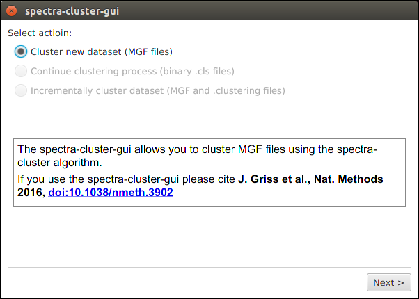

#########################
How to cluster MS/MS data
#########################

This tutorial explains how to cluster MS/MS data using the
`spectra-cluster-cli`_ command line tool.

.. _spectra-cluster-cli: https://github.com/spectra-cluster/spectra-cluster-cli

Preparing your data
===================

The peak list files must be present in the **MGF format**.

Use `ProteoWizard's msconvert`_ tool to convert
your peak list data from other formats. For raw files, 
do not forget to enable the **"peak picking"** filter.

.. _ProteoWizard's msconvert: http://proteowizard.sourceforge.net/

For this tutorial, let's assume that your data looks like this::

    C:\ms_data\
        sample_1.mgf
        sample_2.mgf
        sample_3.mgf

Searching your data
-------------------

Many of the spectra-cluster toolsuite's analysis tools work with
identification data.

To add identification data, first search the above created MGF files with
the search engine of your choice (currently supported are MSGF+,
X!Tandem, MSAmanda, and Scaffold). 

**Important:** You must use the above created MGF files as input for your 
search engine. Otherwise the identification data cannot be mapped to the 
spectra correctly.

If you use **X!Tandem** you must enable the output in the mzIdentML format
by adding the following option to your XML configuration file::

    <note type="input" label="output, mzid">yes</note>

After this step, your files should be prepared similar to this::

    C:\ms_data\
        sample_1.mgf
        sample_1.mzid
        sample_2.mgf
        sample_2.mzid
        sample_3.mgf
        sample_3.mzid

Merging identification data
---------------------------

For the spectra-cluster pipeline tools to integrate your identification data
with the clustering results the identification data needs to be merged with
your MGF files.

This is done using the `mgf_search_result_annotator`_ tool which you can 
download as part of the `spectra-cluster-py (download link)`_ tools.

For this example, we assume that you have copied the 
*mgf_search_result_annotator.exe* into the directory containing your data.

The `mgf_search_result_annotator`_ tool is a command line tool. To use it,
you first need to open the command line. On Windows, for example, press the 
[Windows Key] + [r], enter ``cmd`` and press [Enter].

Next, you have to navigate to the directory containing your search results. In
our example this would look like this::

   C:\Documents and Settings\User> cd \
   C:\>cd ms_data
   C:\ms_data>

Now, to combine your search results with your peak list files you have to
execute the following command (**Note:** you have to adapt the format 
to your search engine. For more information see the 
`mgf_search_result_annotator`_ documentation)::

   C:\ms_data>mgf_search_result_annotator.exe --format MSGF+ --input sample_1.mgf --search sample_1.mzid --output sample_1_annotated.mgf --fdr 0.01 --decoy_string "DECOY"

This command has to be launched for every file (simply adapt the input filename, search result filename, and output name).

Running the clustering
----------------------

Running the actual clustering job is most likely the easiest job once the
MGF files are created.

For this tutorial, we will use the `spectra-cluster-gui`_ to run the
spectra-cluster algorithm.

You can download the latest release of the `spectra-cluster-gui`_ `here`_. In able to launch
the `spectra-cluster-gui`_ you need to have `Java`_ installed on your computer.

.. _spectra-cluster-gui: https://github.com/spectra-cluster/spectra-cluster-gui
.. _Java: https://www.java.com

Once you have downloaded the `spectra-cluster-gui`_ tool, simply extract the zip file
into any folder and double-click the ``spectra-cluster-gui-[VERSION].jar`` file (**Note:**
[Version] will depend on the current version of the `spectra-cluster-gui`_ tool).

.. _here: https://github.com/spectra-cluster/spectra-cluster-gui/releases
.. _mgf_search_result_annotator: http://spectra-cluster-py.readthedocs.io/en/latest/tools/mgf_search_result_annotator.html
.. _spectra-cluster-py (download link): https://github.com/spectra-cluster/spectra-cluster-py/releases

After launching the tool, you need to select "Cluster new dataset" to cluster your files.

Next, simply select the **annotated** MGF files as input files for the clustering.

.. image:: ../_static/spectra-cluster-gui_screen2.png

Clustering settings
~~~~~~~~~~~~~~~~~~~

The default values set in this screen should be working for the vast majority of datasets. The two
values that **should be adapted** are:

  * Precursor tolerance: Set this value to the precursor tolerance that you would use for your search
  * Fragment tolerance: Again, set this value to the fragment ion tolerance you would use for your search

**Note**: If you used a labelled approach you also need to select the appropriate reporter ion type for the
"Remove reporter ion peaks" option.

Launching the clustering
~~~~~~~~~~~~~~~~~~~~~~~~

Simply select where your outputfile should be saved. All other values can generally be left at their default.

